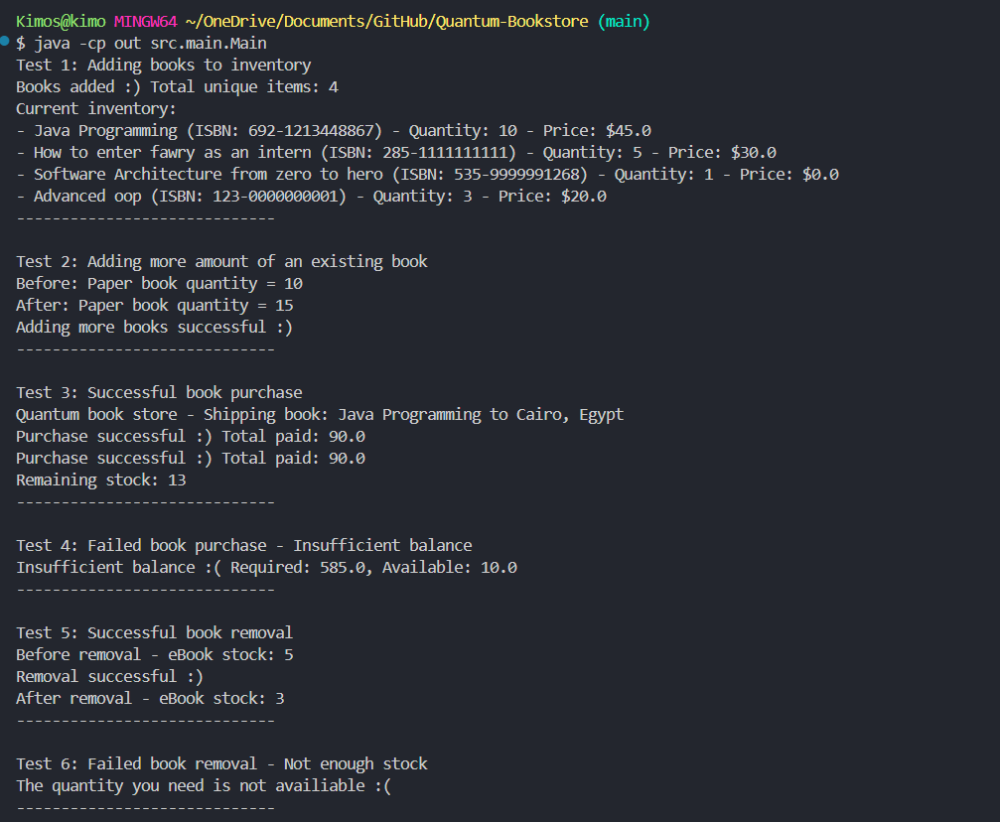
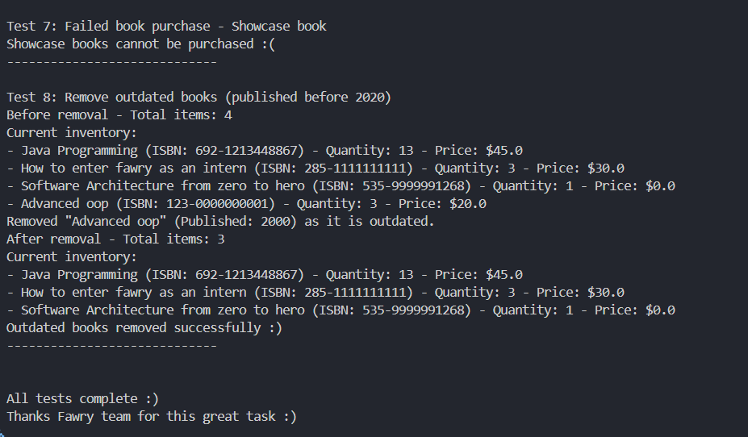

# Bookstore Inventory System

## Project Overview

This is a Java-based bookstore inventory management system that simulates book purchasing functionality. The system handles different types of books (physical, digital, and showcase), inventory management, customer purchasing, and automated shipping/email services. It demonstrates object-oriented programming principles with a clean separation of concerns across different packages.

## Features

- **Multi-type Book Management**: Support for different book types (Paperbooks, EBooks, Showcase books)
- **Inventory Operations**: Add, remove, and purchase books with quantity validation
- **Customer Balance Tracking**: Purchase validation with balance checking
- **Automated Services**: Shipping for physical books and email delivery for digital books
- **Business Logic Enforcement**: Showcase book restrictions and stock validation
- **Maintenance Features**: Automatic removal of outdated books based on publication year

## Project Structure

```
src/
├── book/
│   ├── Book.java             # Base book class with common properties
│   ├── EBook.java            # Digital book implementation
│   ├── Paperbook.java        # Physical book implementation
│   └── Showcasebook.java     # Display-only book implementation
├── inventory/
│   ├── Inventory.java        # Main inventory management system
│   └── InventoryItem.java    # Individual inventory item wrapper
├── main/
│   └── Main.java             # Entry point with comprehensive test cases
└── services/
    ├── ShippingService.java  # Physical book shipping service
    └── MailService.java      # Digital book delivery service
```

## How to Run

### Prerequisites

- Java Development Kit (JDK) 8 or higher
- Command line interface (Terminal/Command Prompt)

### Compilation and Execution

1. **Navigate to the project root directory:**

   ```bash
   cd "path/to/Quantum-Bookstore"
   ```

2. **Compile all Java files:**

   ```bash
   javac -d out src/**/*.java
   ```

3. **Run the application:**
   ```bash
   java -cp out src.main.Main
   ```

## Expected Output

When you run the application, you should see output similar to:

```
Test 1: Adding books to inventory
Books added :) Total unique items: 4
Current inventory:
- Java Programming (ISBN: 692-1213448867) - Quantity: 10 - Price: $45.0
- How to enter fawry as an intern (ISBN: 285-1111111111) - Quantity: 5 - Price: $30.0
- Software Architecture from zero to hero (ISBN: 535-9999991268) - Quantity: 1 - Price: $0.0
- Advanced oop (ISBN: 123-0000000001) - Quantity: 3 - Price: $20.0
-----------------------------

Test 2: Adding more amount of an existing book
Before: Paper book quantity = 10
After: Paper book quantity = 15
Adding more books successful :)
-----------------------------

Test 3: Successful book purchase
Quantum book store - Shipping book: Java Programming to Cairo, Egypt
Purchase successful :) Total paid: 90.0
Purchase successful :) Total paid: 90.0
Remaining stock: 13
-----------------------------

Test 4: Failed book purchase - Insufficient balance
Insufficient balance :( Required: 585.0, Available: 10.0
-----------------------------

Test 5: Successful book removal
Before removal - eBook stock: 5
Removal successful :)
After removal - eBook stock: 3
-----------------------------

Test 6: Failed book removal - Not enough stock
The quantity you need is not availiable :(
-----------------------------

Test 7: Failed book purchase - Showcase book
Showcase books cannot be purchased :(
-----------------------------

Test 8: Remove outdated books (published before 2020)
Removed "Advanced oop" (Published: 2000) as it is outdated.
After removal - Total items: 3
Outdated books removed successfully :)
-----------------------------

All tests complete :)
Thanks Fawry team for this great task :)
```

_This project demonstrates fundamental bookstore inventory management functionality using core Java concepts and object-oriented programming principles._

## Screenshots

### Test Execution - Part 1


### Test Execution - Part 2

